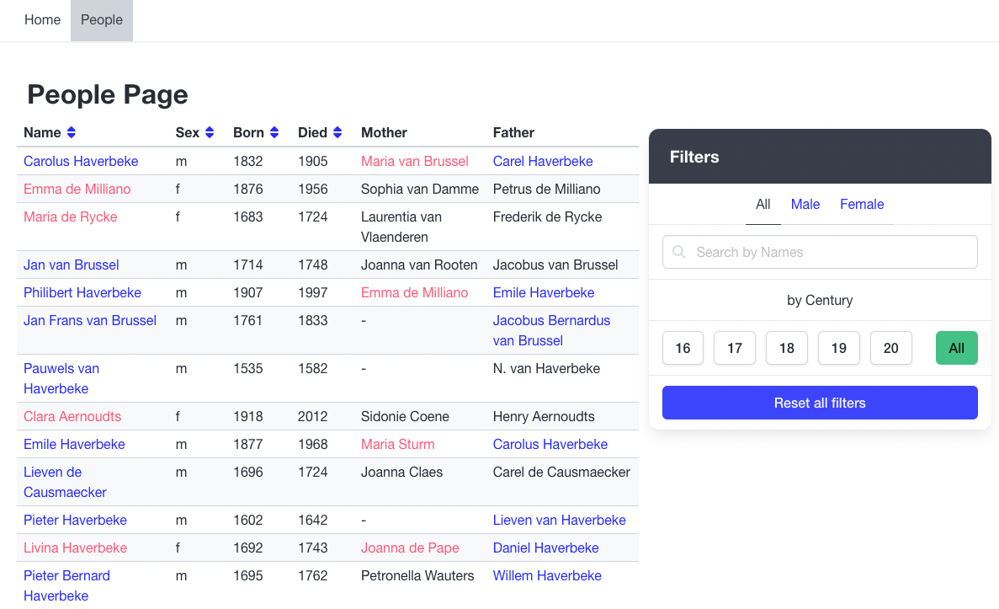

# People-App

A modern React application for managing and viewing people data with advanced filtering and sorting capabilities.

## 📸 Screenshots

<div align="center">
  
  <p><em>Main view with people list and filters</em></p>
  
  
  <p><em>Search functionality in action</em></p>
  
  
  <p><em>Filtering options: gender and century selection</em></p>
  
  
  <p><em>Sorting functionality with visual indicators</em></p>
</div>

## 🌟 Features

- **Advanced Search & Filtering**

  - Search by name, mother's name, or father's name
  - Filter by gender
  - Filter by century
  - URL-based search parameters for easy sharing

- **Sorting Capabilities**

  - Sort by name, sex, birth year, or death year
  - Ascending and descending order
  - Visual indicators for current sort state

- **Modern UI**
  - Responsive design using Bulma CSS framework
  - Clean and intuitive interface
  - Loading states and error handling
  - Font Awesome icons integration

## 🛠️ Tech Stack

- React 19
- TypeScript
- React Router
- Context API
- UrlSearchParams
- Bulma CSS
- Font Awesome
- GitHub Pages

## 📦 Project Structure

```
src/
├── components/     # Reusable UI components
├── context/        # React context for state management
├── pages/          # Page components
├── types/          # TypeScript type definitions
├── utils/          # Utility functions
└── api.ts          # API integration
```

## 🔍 Usage

1. **Searching**

   - Use the search bar to find people by name or parent's name
   - Search is case-insensitive and works in real-time

2. **Filtering**

   - Select gender from the dropdown
   - Choose centuries using checkboxes
   - Multiple filters can be combined

3. **Sorting**
   - Click on column headers to sort
   - Click again to change sort direction
   - Current sort is indicated by an arrow icon

## 🎯 Live Demo

Check out the live version at: [https://artem-brui.github.io/People-App/](https://artem-brui.github.io/People-App/)

## 🚀 Getting Started

### Prerequisites

- Node.js (v14 or higher)
- npm (v6 or higher)

### Installation

1. Clone the repository:

```bash
git clone https://github.com/Artem-Brui/People-App.git
cd People-App
```

2. Install dependencies:

```bash
npm install
```

3. Start the development server:

```bash
npm run dev
```

The application will be available at `http://localhost:5173`

### Building for Production

To create a production build:

```bash
npm run build
```

### Deployment

The application is automatically deployed to GitHub Pages. To deploy manually:

```bash
npm run deploy
```
